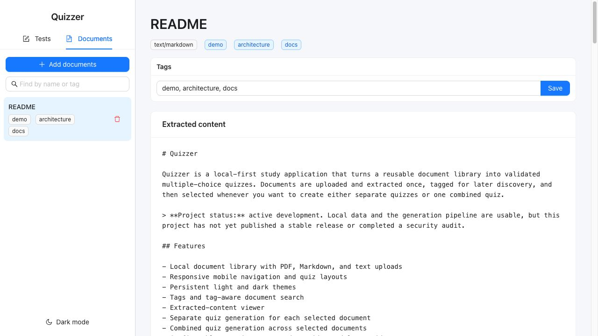
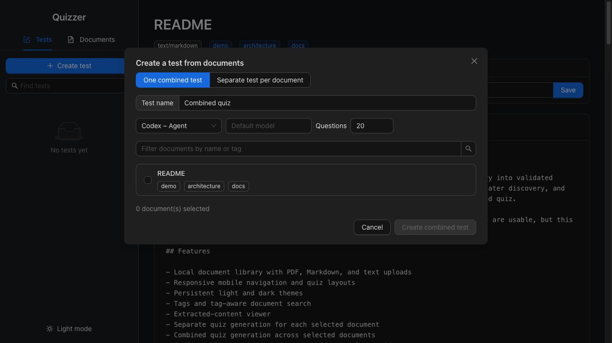
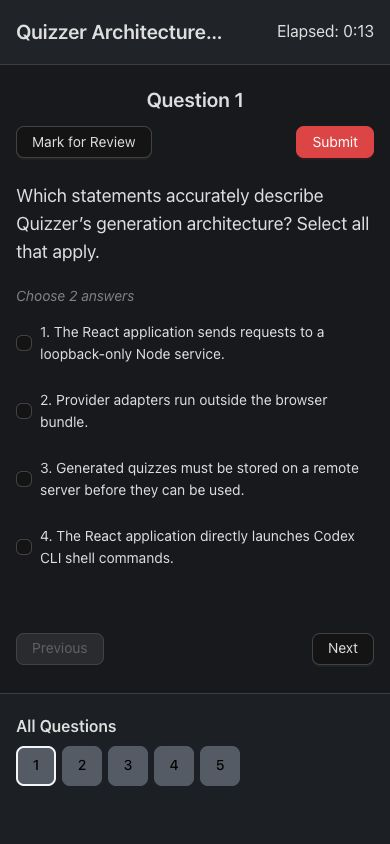
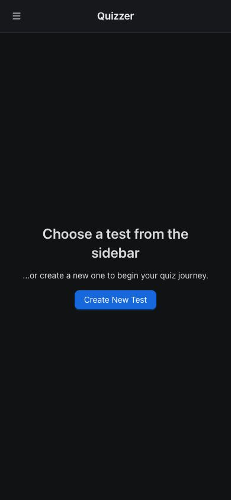

# Quizzer

Quizzer is a local-first study application that turns a reusable document library into validated multiple-choice quizzes. Documents are uploaded and extracted once, tagged for later discovery, and then selected whenever you want to create either separate quizzes or one combined quiz.

> **Project status:** active development. Local data and the generation pipeline are usable, but this project has not yet published a stable release or completed a security audit.

## Screenshots

| Document library | Quiz creation |
| --- | --- |
|  |  |

| Mobile quiz | Mobile results |
| --- | --- |
|  |  |

## Features

- Local document library with PDF, Markdown, and text uploads
- Visible extraction progress with per-file retry on failure
- Responsive mobile navigation and quiz layouts
- Persistent light and dark themes
- Tags and tag-aware document search
- Extracted-content viewer
- Separate quiz generation for each selected document
- Combined quiz generation across selected documents
- Configurable question count and provider model override
- Configurable mix of multiple-choice, fill-in-the-blank, and reasoning questions
- Normalized fill-in-the-blank grading across generated acceptable wordings
- Learner self-assessment against reference answers for reasoning questions
- In-app Plugins & models panel for setup and defaults
- Codex, Claude Code, and Antigravity agent integrations using existing CLI authentication
- Gemini, Anthropic Claude, OpenAI, OpenRouter, and DeepSeek API integrations
- Structured provider output and runtime question validation
- Live generation progress by test, question type, and retry round
- Persistent background generation queue, usable while you take completed tests
- Configurable 1–10 concurrent test instances
- Configurable 5–25 questions per provider request, defaulting to 20
- Mid-generation cancellation that stops all active provider processes
- Provider failover that preserves accepted questions after quota, authentication, or service failures
- Automatic recovery from reloads and network interruptions at the latest verified checkpoint
- Bounded refill attempts: valid questions survive when another candidate is rejected
- Exact and lexical near-duplicate filtering
- Optional local semantic duplicate filtering through Ollama
- Optional Marker PDF conversion with tables, equations, and extracted figures
- Fresh AI-generated practice for concepts missed on the latest attempt
- Local quiz, document, and attempt storage through IndexedDB

## How it works

```text
PDF / Markdown / text
          │
          ▼
  Document extraction ──────► IndexedDB document library
  (Marker or fallback)          content + tags + figures
                                      │
                                      ▼
                              Select document(s)
                                      │
                         ┌────────────┴────────────┐
                         ▼                         ▼
                  Signed-in agents            API providers
             Codex · Claude · Antigravity   Gemini · Claude · OpenAI
                                            OpenRouter · DeepSeek
                         └────────────┬────────────┘
                                      ▼
                         validate + reject duplicates
                                      ▼
                              saved local quiz
```

The React application never starts shell commands directly. It calls a loopback-only Node service, which invokes provider adapters and keeps API credentials outside browser bundles. Generation jobs and their verified checkpoints live in IndexedDB, so the browser can resume unfinished work after reconnecting or reopening Quizzer.

## Requirements

- Node.js 20 or newer
- npm
- At least one configured generation provider (a signed-in agent or an API key)

Marker and the local semantic duplicate filter are optional and installable from Quizzer. Neither is required for the basic document and quiz flow.

## Quick start

```sh
git clone https://github.com/Somethings1/quizzer.git
cd quizzer
npm ci --legacy-peer-deps
npm run dev
```

Open the Vite URL printed in the terminal, normally `http://localhost:5173`.

`npm run dev` starts both the browser development server and the loopback generation service. The service listens on `127.0.0.1:8787` by default.

### Tailscale access

On macOS, double-click `start-tailscale.command` in Finder. It detects the active Tailscale address, installs npm dependencies when needed, and prints the private URL to open from another device on the same tailnet. Keep its Terminal window open while using Quizzer and press Control-C to stop it.

The same launcher is available from a terminal as `npm run tailscale`. It binds Vite to the Tailscale interface rather than exposing Quizzer on every LAN interface.

## Provider setup

Open **Plugins & models** at the bottom of the sidebar. This panel is the central place to:

- install and check Marker;
- install and connect supported CLI agents;
- enter keys for Gemini, Anthropic Claude, OpenAI, OpenRouter, or DeepSeek;
- install Ollama and the lightweight `all-minilm` semantic filter;
- save the default provider and model for each provider.

The Create Test dialog starts with those defaults and lets you choose a different provider or model for an individual test.

### Codex Agent

Install the Codex CLI once, then select **Connect Codex** in **Plugins & models**. Quizzer starts the Codex device sign-in flow and displays its sign-in link and instructions in the popup. Quizzer invokes Codex ephemerally, uses a read-only sandbox, and supplies a JSON Schema for the final response. Leaving the model field blank uses the Codex default.

### Gemini API

Enter the Gemini API key and default model in **Plugins & models**. The key is retained only in the current browser tab and sent to the loopback service for requests. No environment variable or terminal configuration is required.

### Claude and Antigravity agents

Select **Install Claude** or **Install Antigravity** if its CLI is missing, then select **Connect** and finish the provider's browser sign-in. Quizzer uses each CLI's documented non-interactive JSON Schema mode and disables or sandboxes agent tool access during quiz generation.

### API providers

Gemini, Anthropic Claude, OpenAI, OpenRouter, and DeepSeek are configured the same way: enter a key and default model under **Plugins & models**, then select that provider while creating a test. Keys are retained only for the current browser tab. DeepSeek uses JSON mode plus Quizzer's runtime validation; the other adapters request schema-constrained output where supported.

End users do not configure providers in a terminal. Provider installation, account connections, model selection, API credentials, quiz settings, and theme selection all live in the application UI.

## PDF conversion

Quizzer offers two upload modes:

- **Automatic:** attempts Marker and falls back to browser-based PDF text extraction.
- **Basic:** uses PDF.js text extraction only.

Select **Install Marker** in **Plugins & models** for better preservation of document structure. Quizzer creates a private Python environment under `.quizzer-tools/marker`, downloads Marker there, and uses it automatically. Installation can take several minutes and requires an internet connection and substantial disk space.

When Marker succeeds, Quizzer stores its Markdown plus up to 30 extracted images and supplies those images to the selected multimodal provider. Marker is a substantial optional dependency and its code/model licenses should be reviewed for your distribution and commercial-use requirements.

Scanned or visually complex documents can still require manual review. Always inspect extracted content before generating a high-stakes quiz.

## Creating a quiz

1. Open the **Documents** sidebar tab.
2. Select **Add documents**, choose files, and optionally assign comma-separated tags.
3. Inspect a document's extracted content from the main view.
4. Open the **Tests** tab and select **Create test**.
5. Filter and select documents by name or tag.
6. Choose one combined quiz or one separate quiz per document.
7. Choose how many multiple-choice, fill-in-the-blank, and reasoning questions to create.
8. Select a provider and optional provider-specific model.
9. Queue generation and continue using Quizzer.

The creation dialog closes immediately after saving the job. Each instance is assigned to a different test and makes one provider request at a time. Within that test, each question type is generated sequentially using the configured batch size. The default is 20, so 45 missing questions become requests of 20, 20, and 5; each later prompt can exclude everything accepted from earlier batches. Other instances work on other tests rather than generating overlapping candidates for the same test.

Open **Generation queue** to choose between 1 and 10 concurrent test instances; the default is 5. Lower values reduce simultaneous provider usage and memory pressure. Higher values complete multi-document queues faster. Reducing the value does not abort requests already running—the new limit takes effect as they finish.

The same panel controls batch size from 5 to 25 questions, defaulting to 20. Larger batches reduce request overhead, while smaller batches create more frequent recovery checkpoints and reduce the amount of work lost when a provider returns malformed output. Refill requests always ask for the exact remaining count when it is smaller than the configured batch size.

Every candidate is independently validated and deduplicated before the next batch begins. Rejected candidates leave only their missing slots for the next bounded refill round. If a target cannot be reached after five rounds, Quizzer saves the valid partial quiz instead of retrying forever.

Open **Generation queue** from the sidebar or the floating activity indicator to inspect every job, cancel work, retry an error, or switch providers. As each separate test completes it appears in the Tests sidebar immediately, where you can take it while later jobs continue.

After every validated parallel round, Quizzer checkpoints accepted questions, retry counters, and provider settings to IndexedDB. A dropped connection moves the job into a waiting state and retries automatically when connectivity returns. Reloading or closing the page stops active computation, but reopening Quizzer requeues interrupted jobs from the latest checkpoint; it never restarts accepted batches from zero.

If a provider runs out of quota, loses authentication, or becomes unavailable, generation pauses and offers another provider. Already accepted questions remain in memory, the replacement provider requests only the missing slots, and duplicate detection compares its output against the full accepted set. Switching providers does not consume a validation retry round.

Fill-in-the-blank answers ignore capitalization, punctuation, and repeated spaces, and match any acceptable wording supplied with the generated question. Reasoning answers are never graded by another model: the learner reveals the reference answer, compares the essential points, and records a self-assessment.

Select **Install Ollama + all-minilm** under **Plugins & models** to enable local semantic duplicate filtering. On macOS Quizzer uses Homebrew to install Ollama when needed; on Linux it uses Ollama's official installer. It then starts the local runtime and downloads `all-minilm`. If that plugin is unavailable, generation continues automatically with normalized exact matching and lexical similarity.

## Data and privacy

- Documents, original uploaded blobs, extracted figures, quizzes, and attempts are stored in the browser's IndexedDB database named `QuizDB`.
- Background generation jobs, accepted questions, and retry checkpoints are also stored in IndexedDB until dismissed.
- Agent requests use the selected locally authenticated CLI.
- API requests send selected extracted content—and figures for supported multimodal models—to the selected provider.
- API keys pass through the loopback service only for the active request and remain in browser session storage; they are not written to IndexedDB or local storage.
- Deleting browser site data deletes the local Quizzer library.
- Export important quizzes before clearing browser storage.

Do not upload confidential material unless the selected provider and your account's data-handling terms are appropriate for it.

## Commands

| Command | Purpose |
| --- | --- |
| `npm run dev` | Start the local service and Vite development server |
| `npm run tailscale` | Start Quizzer on this machine's Tailscale address |
| `npm run dev:web` | Start only Vite; generation endpoints must be provided separately |
| `npm run service` | Start only the loopback generation service |
| `npm run build` | Type-check and create the production browser bundle |
| `npm run lint` | Run ESLint |
| `npm run preview` | Preview the browser bundle; start the service separately for generation |

The development service uses its internal loopback port automatically. Packagers may override `QUIZZER_SERVICE_PORT` and the matching Vite proxy when building a custom distribution.

## Troubleshooting

### Quizzer asks for an API key

Enter the provider's key in **Plugins & models → API providers**. It is intentionally forgotten when the browser tab closes.

### `spawn codex ENOENT`

Install Codex CLI and ensure `codex` is available on `PATH` for the process starting Quizzer. Authentication itself can then be completed from **Plugins & models**.

### An agent reaches its usage limit

Open **Generation queue**, select a configured replacement provider on the paused job, and choose **Continue**. Accepted questions are preserved. If the replacement uses an API key you have not entered, open **Plugins & models** directly from the job first.

### Generation was interrupted

Keep or reopen Quizzer on the same browser origin. Network failures retry automatically after connectivity returns. Jobs that were active when the page closed are requeued from their latest verified batch when the application opens again. API keys remain session-only, so a restored job may pause for authentication if its browser session ended.

### Semantic filtering is not active

Open **Plugins & models** and install the semantic duplicate filter. If installation fails, review the live installer output. Quiz generation still uses exact and lexical duplicate checks without it.

### Marker is not used

Open **Plugins & models** and select **Install Marker**. The popup shows live installation progress and any error. Until Marker is ready, Automatic mode silently uses basic extraction.

### A quiz contains fewer questions than requested

The generation pipeline reached its bounded retry limit after rejecting malformed or duplicate candidates. The accepted questions are retained. Try filling the missing concepts again or reduce the requested count for a small source document.

## Development notes

- Provider-specific behavior belongs in the local service; the UI works with Quizzer's internal generation contract.
- Do not assume third-party CLIs share command flags or output events. Add an adapter per provider.
- New quiz fields require both TypeScript types and runtime validation.
- Database schema changes require a new Dexie version and a migration strategy.
- Duplicate thresholds should be evaluated against representative quiz sets before changing defaults.

## Roadmap

- Provider capability discovery and custom endpoint adapters
- Provider-specific concurrency and cost limits
- Question/source citations in the review interface
- Document re-extraction and converter version tracking
- Full automated unit, integration, and browser test suites
- Production packaging for the local service and static application

## Security

Please do not publish suspected vulnerabilities in a public issue. Contact the repository owner privately with reproduction steps and affected versions. The local service binds to loopback only and provider inputs are treated as untrusted, but the project has not yet undergone an independent security review.

## License

This repository currently contains no license file. No permission to redistribute or modify the project should be assumed until the owner adds an explicit license. Optional dependencies, including Marker and its model weights, have their own license terms.
