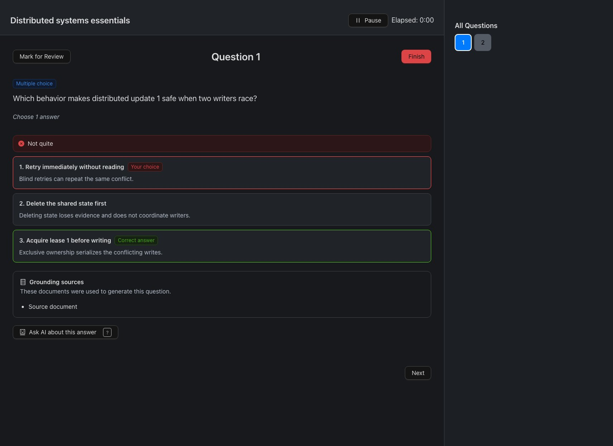
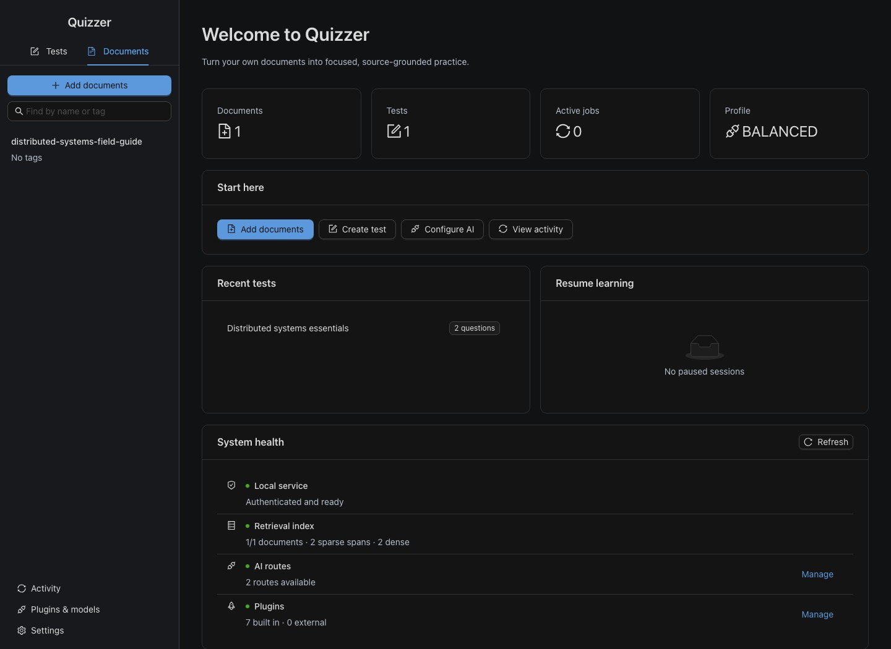
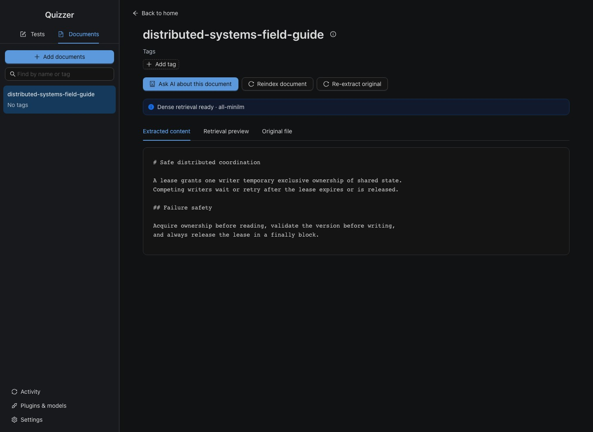

<p align="center">
  
</p>

<h1 align="center">Quizzer</h1>

<p align="center">
  <strong>Turn your own documents into focused, citation-backed practice.</strong>
  <br>
  Local-first storage. Your choice of AI. Questions that can show their work.
</p>

<p align="center">
  <a href="https://github.com/longnt27/quizzer/actions/workflows/ci.yml"></a>
  <a href="https://github.com/longnt27/quizzer/releases"></a>
  <a href="LICENSE"></a>
  <a href="SECURITY.md"></a>
</p>

<p align="center">
  <a href="#install">Install</a> ·
  <a href="#from-source-to-understanding">How it works</a> ·
  <a href="#rag-you-can-inspect">RAG quality</a> ·
  <a href="#bring-the-ai-you-already-use">AI providers</a> ·
  <a href="#command-line">CLI</a>
</p>



Quizzer builds quizzes from PDF, Markdown, and text without turning your library into an opaque chat history. It keeps documents, tests, progress, and generation checkpoints on your machine; sends only the retrieved excerpts you approve; and attaches stable source spans to every accepted question.

> [!NOTE]
> **Public beta available:** `v1.0.0-beta.5` is ready to install. Downloads are protected by a signed manifest and SHA-256 checksums. The app does not yet have paid Apple notarization or a Windows publisher certificate, so those systems may show an unidentified-developer or unknown-publisher warning.

## Install

No Node.js, Python, Git, or package manager is required.

**macOS and Linux**

```sh
curl -fsSL https://github.com/longnt27/quizzer/releases/download/v1.0.0-beta.5/install.sh | sh
```

**Windows PowerShell**

```powershell
irm https://github.com/longnt27/quizzer/releases/download/v1.0.0-beta.5/install.ps1 | iex
```

The installer detects x64 or arm64, verifies the release before installing, adds `quizzer` to your user PATH, registers the desktop app, and opens the guided setup. The command installers are Quizzer's supported distribution path.

<details>
<summary><strong>Supported systems</strong></summary>

| Operating system | Architectures | Baseline |
| --- | --- | --- |
| Windows | x64, arm64 | Windows 10/11 on x64; Windows 11 on arm64 |
| macOS | Intel x64, Apple silicon | macOS 13 or newer |
| Linux | x64, arm64 | Current 64-bit Debian/Ubuntu and Fedora-class systems |

Lite is the CPU-only baseline. Local generation in Balanced or Max depends on the chosen model's RAM, disk, and acceleration requirements. Remote APIs and signed-in agents work on lower-spec hardware.

</details>

## Why Quizzer

| Grounded by default | Local-first, not locked-in | Built for real study |
| --- | --- | --- |
| Every accepted question retains the evidence used to create it. Open citations during practice instead of trusting a plausible answer. | Keep the library locally and choose Ollama, llama.cpp, an existing coding-agent sign-in, an API, or a plugin. | Mix multiple choice, fill-in-the-blank, reasoning, and coding. Add a learning goal such as “Terraform coding questions only.” |
| **Durable work** | **Simple when you want it** | **Honest failure handling** |
| Indexing, generation, attempts, and paused practice survive restarts. Completed slots are not regenerated. | Simple mode is a short source → goal → preset flow. Advanced mode reveals prompts, RAG, routes, cost ceilings, and validation controls. | Low-confidence retrieval gets one corrective pass, then refuses. Quota failures preserve accepted questions and resume only unfinished work. |

## From source to understanding

1. **Import a real document.** Quizzer extracts text and figures, keeps the original in content-addressed storage, and builds a searchable local index.
2. **Say what you want to learn.** Select one or more sources, choose a preset, and add an optional custom instruction.
3. **Review privacy and cost.** Approve exactly which local, agent, or API route may receive retrieved excerpts.
4. **Generate in the background.** Retrieval, validation, duplicate checks, and durable checkpoints run per coverage slot.
5. **Practice with evidence.** Get immediate feedback, open the source spans behind a question, or ask AI within the same document scope.

<table>
  <tr>
    <td width="50%"></td>
    <td width="50%"></td>
  </tr>
  <tr>
    <td align="center"><sub>One place for recent tests, resumable work, and system health</sub></td>
    <td align="center"><sub>Inspect extraction, indexing, tags, originals, and retrieval</sub></td>
  </tr>
</table>

The first-run walkthrough performs this real flow rather than showing a disconnected slideshow. It can be paused, skipped, resumed after a restart, or restarted later from the sidebar.

## RAG you can inspect

Quizzer does not paste an entire file into a model and hope for a good quiz. It creates durable coverage slots, retrieves bounded evidence for each slot, and saves only candidates that pass quality gates.

```text
documents + tags
      │
      ▼
structural chunks (pages · headings · code · tables · images)
      │
      ├── SQLite FTS5 / BM25 ─────────┐
      └── optional dense embeddings ──┤
                                      ▼
                         rank fusion → rerank → diversity
                                      │
                                      ▼
                      parent + neighboring source context
                                      │
                                      ▼
                         evidence-bounded generation
                                      │
                                      ▼
             schema · grounding · instruction · duplicate checks
                                      │
                                      ▼
                         question + stable citations
```

### Retrieval quality

- **Hybrid search:** Lite always includes local FTS5/BM25. Balanced and Max can add versioned LanceDB embeddings, metadata filters, reciprocal-rank fusion, reranking, and maximal-marginal-relevance diversity.
- **Structure-aware chunks:** pages, headings, code blocks, tables, lists, and image anchors stay identifiable. A selected child span can expand to its parent and neighbors without losing the citation ID.
- **Coverage before generation:** question targets become unique slots. A rejected candidate refills only its missing slot; previously accepted work remains checkpointed.
- **Grounding gates:** the question, correct answer, and explanation are checked against retrieved evidence. Malformed, ungrounded, out-of-scope, and instruction-breaking output is rejected.
- **Bounded correction:** weak evidence triggers one corrective retrieval pass. If it is still insufficient, Quizzer refuses instead of inventing an answer.

### How duplicate questions are stopped

Duplicate checks compare every candidate with all accepted questions—including questions generated in earlier calls, before a restart, or by a previous provider:

1. Unicode normalization, case folding, punctuation removal, and whitespace collapsing reject exact normalized matches.
2. Token-set Jaccard similarity at `0.82` or higher rejects close lexical paraphrases.
3. When embeddings are enabled, cosine similarity at `0.90` or higher rejects semantic paraphrases with different wording.
4. A question must fill a unique coverage slot. Rejections and reasons are checkpointed; only the missing slot is requested again.

Lite retains exact and lexical protection without a dense model. Balanced and Max add the semantic layer.

### Reproducible regression gates

The repository includes deterministic English and Vietnamese RAG fixtures. They are engineering regression tests—not a promise that every document will score identically.

| Metric | Required | Current fixtures |
| --- | ---: | ---: |
| Recall@10 | ≥ 90% | 100% |
| Citation precision | ≥ 95% | 100% |
| Refusal accuracy | ≥ 90% | 100% |

Run `npm run eval:rag` to reproduce them. Mock-provider tests separately cover schema validity, grounding, custom-instruction adherence, coverage uniqueness, provider failover, malformed responses, cancellation, and duplicate rejection without paid calls.

## Pick the profile, override the parts

| Profile | Good for | Default retrieval and generation |
| --- | --- | --- |
| **Lite** | Any supported CPU | Basic extraction, FTS5/BM25, exact/lexical duplicate checks, remote or agent generation |
| **Balanced** | Everyday laptops and desktops | OCR on demand, MiniLM-class embeddings, hybrid retrieval, lightweight reranking, optional small local model |
| **Max** | Machines with more RAM, disk, and acceleration | Visual extraction, multilingual embeddings, stronger reranking, multi-query/HyDE, managed local generation |

Quizzer scans CPU, memory, architecture, and free disk space to recommend a starting profile. No large model is downloaded without confirmation, and every component remains independently configurable in Advanced mode.

## Bring the AI you already use

| Route | Options |
| --- | --- |
| Fully local | Ollama, managed llama.cpp, local generator plugins |
| Signed-in agents | Codex, Claude, Antigravity |
| APIs | Gemini, Anthropic, OpenAI, OpenRouter, DeepSeek |
| Custom | OpenAI-compatible endpoints and versioned out-of-process plugins |

Routes carry capability, privacy, and cost metadata. Quizzer can continue through routes you pre-approved, but pauses before using a paid or less-private route. If a provider reaches quota, open **Activity**, choose a replacement, and select **Continue**—accepted questions stay put.

## Data and privacy

- SQLite stores authoritative documents, tests, attempts, jobs, and unfinished sessions in the operating system's application-data directory.
- Original files and extracted figures live in a SHA-256 content-addressed object store. Sparse and dense indexes are rebuildable and stored separately.
- The desktop keeps remembered credentials in OS-backed encrypted storage. Session credentials remain in memory. Secrets are excluded from jobs, logs, exports, backups, and diagnostics.
- Local providers keep generation local. Remote routes receive only the selected excerpts and relevant images after explicit approval.
- Backups include the authoritative database, safe configuration, and verified objects. Restores preserve the previous library as a recovery backup before replacement.

Local-first does not make every provider private. Check the data-handling terms of any remote provider before sending confidential material.

## Command line

The installer includes the same durable core as the desktop app:

```sh
quizzer doctor
quizzer documents import ./notes.pdf --tags infrastructure,terraform
quizzer index --all
quizzer test create --document DOCUMENT_ID --questions 20 \
  --instruction "Terraform coding questions only"
quizzer jobs list
quizzer resume JOB_ID --provider claude-agent
quizzer backup create
```

Run `quizzer help` for every command. Usage-priced routes require explicit approval, and resuming with another provider preserves the stored learning instruction, prompts, RAG settings, citations, and accepted questions.

## Build and contribute

Source development requires Node.js 20 or newer:

```sh
git clone https://github.com/longnt27/quizzer.git
cd quizzer
npm ci
npm run dev
```

Useful checks:

```sh
npm run lint
npm test
npm run test:coverage
npm run eval:rag
npm run test:e2e
npm run screenshots:readme
npm run build
```

The screenshot task starts an isolated local service and mocked provider, then recreates the README images from the current UI without opening a developer library or making paid calls.

Read [CONTRIBUTING.md](CONTRIBUTING.md) before sending a pull request and follow the [Code of Conduct](CODE_OF_CONDUCT.md). Use [GitHub Issues](https://github.com/longnt27/quizzer/issues) for reproducible bugs, [GitHub Discussions](https://github.com/longnt27/quizzer/discussions) for ideas and questions, and private vulnerability reporting for security issues.

Development changes merge into `develop`; `main` is reserved for tested, squash-merged release promotions. Releases are tagged and dispatched automatically after a versioned `develop` → `main` pull request is merged. See [RELEASING.md](RELEASING.md).

## Documentation

- [OpenAPI v1](openapi/quizzer-v1.yaml) — authenticated settings, onboarding, documents, retrieval, jobs, and backup APIs.
- [Plugin SDK](plugin-sdk/README.md) — capabilities, permissions, lifecycle, manifests, and JSON-RPC runtime.
- [Signed plugin registry](docs/plugin-registry.md) — trust, installation, updates, and rollback.
- [Security policy](SECURITY.md) — supported versions and private reporting.
- [Maintainer release guide](RELEASING.md) — release validation and publication.

## License

Quizzer is released under the [Apache License 2.0](LICENSE). Distribution must retain [NOTICE](NOTICE). Optional tools, downloaded model weights, and third-party dependencies keep their own licenses.
